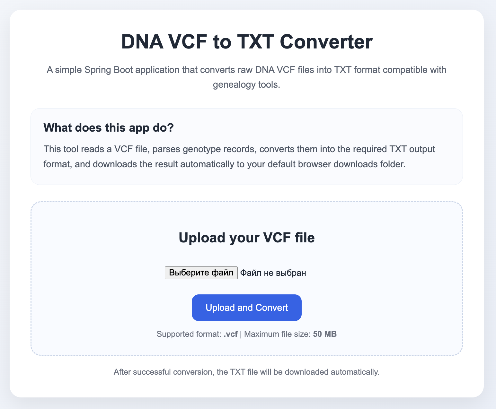

# DNA VCF → TXT Converter

A small **Java (Spring Boot)** utility that converts DNA test results from **VCF format** into a **plain TXT format** compatible with genealogy tools (such as **GEDmatch-style uploads**).

The project also includes a **simple web UI** that allows uploading a `.vcf` file and automatically downloading the converted TXT result.

---

## 🌐 Web Interface

The application includes a small browser UI for convenient file conversion.

Upload your VCF file → click **Upload and Convert** → the converted TXT file will be downloaded automatically.




---

# Background

I received my DNA test results in **VCF format** and wanted to upload them to other genealogy platforms.

However, many of these services require a **simple text format similar to the one used by 23andMe**.

To automate the conversion process, I created this small tool that:

- reads a **VCF file**
- applies several **data normalization and transformation rules**
- outputs a **clean TXT file suitable for genealogy platforms**

The project was also a good opportunity to practice building a **small but structured Spring Boot application** with parsing, transformation, and testing layers.

---

# Input Format

The application expects a **VCF-like file with tab-separated columns**.

Example input:

```vcf #CHROM POS ID REF ALT QUAL FILTER INFO FORMAT sample
chr1    123     .       A   G   .   .   .   GT  0|0
chr2    456     rs2     C   T   .   .   .   GT  0|1
chrX    789     rsX     G   A   .   .   .   GT  1|0
chrM    1011    .       T   C   .   .   .   GT  1|1
```

---

# Output Format

The program generates a **TXT file** with the following columns:

Example output:


```
1_123 1 123 AA
rs2 2 456 CT
rsX X 789 GA
MT_1011 MT 1011 CC
```

---

# Running the Application

## 1. Clone the repository

```bash
git clone https://github.com/yourusername/dna-vcf-converter.git
cd dna-vcf-converter
```
## 2. Build the project
```bash
   ./gradlew build
```

This will:

- compile the project
- run tests 
- produce a runnable jar

## 3. Run the application
```
./gradlew bootRun
```
The server will start on:
```
http://localhost:8080
```

## 4. Using the Web UI
 - Open the application in your browser:
```
http://localhost:8080
```
- Upload a **.vcf file**

- Click **Upload and Convert**

- After conversion, the TXT file will automatically download to your browser's default downloads folder.

## Example Directory Setup

For convenience you can run the conversion command directly from the project directory.
```
dna-converter/
├── dna.vcf
└── result.txt
```
Then execute the request:

```bash
curl -X POST http://localhost:8080/api/v1/vcf/convert \
  -F "file=@dna.vcf" \
  -o result.txt
```
After the request completes, the converted file will be saved as:
```
result.txt
```

## Running Tests

Run the full test suite with:

```bash
./gradlew test
```

Tests include:
- genotype conversion logic
- VCF parsing
- TXT writing
- integration test using real input/output files

## Tech Stack

- Java 17
- Spring Boot
- Gradle
- JUnit 5

## Project Structure
```
controller
service
parser
converter
writer
model
exception
```
Each layer has a single responsibility:

| Layer      | Responsibility                         |
|------------|----------------------------------------|
| parser     | read VCF records                       |
| converter  | transform genotype data                |
| writer     | generate TXT output                    |
| service    | orchestrate the conversion pipeline    |
| controller | handle file uploads                    |
---
# Conversion Rules

The converter applies several transformations to make the file compatible with genealogy tools.

---

## Chromosome normalization

| Input | Output |
|------|------|
| chr1 | 1 |
| chrX | X |
| chrM | MT |

---

## Genotype reconstruction

VCF encodes genotype values as indexes referencing **REF** and **ALT** columns.

| GT value | Result genotype |
|---------|----------------|
| 0/0 or 0\|0 | REF + REF |
| 0/1 or 1/0 | REF + ALT |
| 1/1 | ALT + ALT |
| ./. | -- |

Example:
```
REF = A
ALT = G
GT = 0|1 → AG
```

---
## RSID handling

Some VCF files contain multiple identifiers:
s371240719;rs28509370


Only the **first identifier** is used.

If no rsid is available (`.`), a synthetic ID is generated:

Example:
```
s371240719;rs28509370
```
## SNP filtering

Rows where **REF or ALT contain more than one base** (insertions/deletions) are ignored.

Example ignored:
```
REF = ACC
ALT = A
```